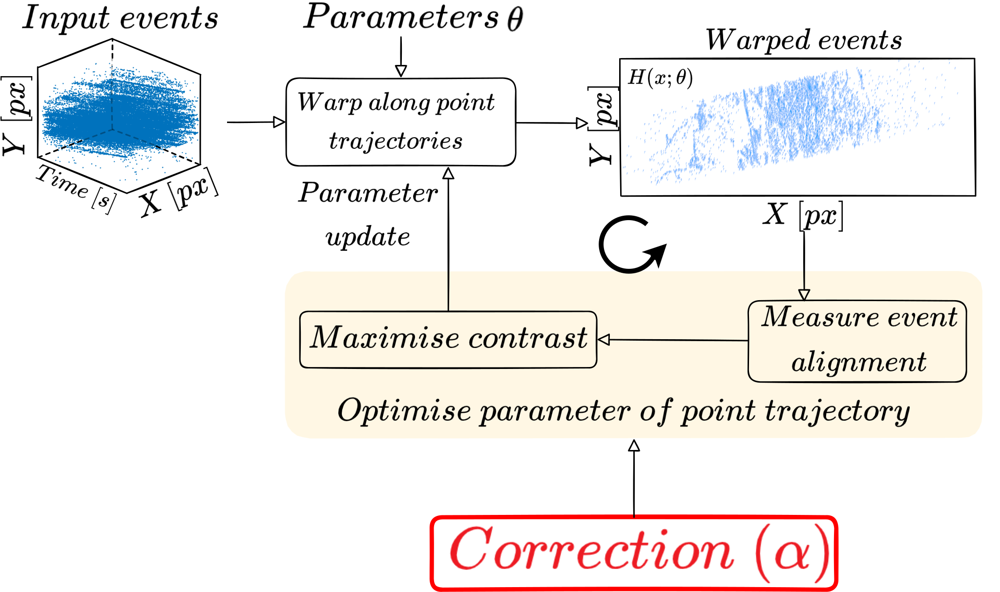
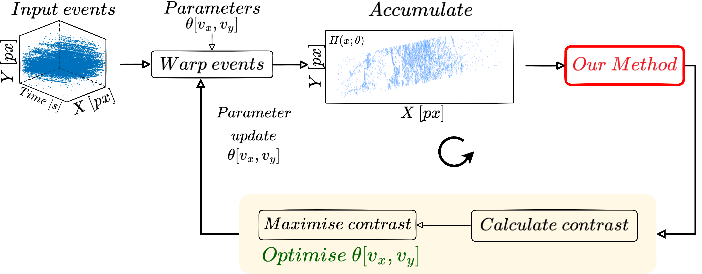
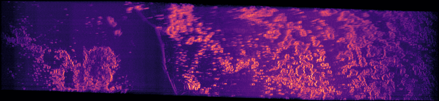

# Analytically Corrected Contrast Maximisation for Orbital Imagery with Neuromorphic Cameras

This contains the implementation of the paper "Analytically Corrected Contrast Maximisation for Orbital Imagery with Neuromorphic Cameras".

<!-- <p align="center">
      
      
       -->
<!-- </p> -->

<p align="center">
  
&nbsp; &nbsp; &nbsp; &nbsp;
  
&nbsp; &nbsp; &nbsp; &nbsp;
  
</p>

## Install

```sh
git clone git@github.com:neuromorphicsystems/event_warping.git # alternatively, download as zip
cd event_warping
python3 -m pip install -e .
```

The installation process compiles the event_warping_extension, which is required to speed up event projection calculations. If the installation fails, you may need to install a C++ compiler with one of the following methods:

-   **Ubuntu**

    ```sh
    sudo apt install -y build-essentials
    ```

-   **macOS**

    ```sh
    xcode-select --install
    ```

-   **Windows**

    Start > Windows Powershell > Right click > Run as Administator

    ```powershell
    Set-ExecutionPolicy Bypass -Scope Process -Force; [System.Net.ServicePointManager]::SecurityProtocol = [System.Net.ServicePointManager]::SecurityProtocol -bor 3072; iex ((New-Object System.Net.WebClient).DownloadString('https://community.chocolatey.org/install.ps1'))
    choco install -y visualstudio2019buildtools
    choco install -y visualstudio2019-workload-vctools
    ```

    See https://chocolatey.org for details.

## Usage

Python files in _scripts_ implement two different methods to estimate the visual speed (px/s) for the ISS recordings:

1. The implementation of the standard Contrast Maximisation framework which uses the variance as an objective function.
2. The method proposed in this paper which divides the Contrast Maximisation process into multiple peicewise fuctions and apply multiplicative weight to remove the global maxima to preserving the correct motion parameter.

To run the code it is recommended to have the have the recording in either `.es` or `.h5`. If your events data are in `.mat` format, then use `scripts/mattoes.py` to convert them to`.es`. Otherwise, please refer to [command_line_tool](https://github.com/neuromorphic-paris/command_line_tools) and [event_stream](event_stream) to learn more about how to convert and process your event data in `.es`.


Before running the example, create a directory called _recordings_ in the _event_warping_ directory and place `20220124_201028_Panama_2022-01-24_20~12~11_NADIR.h5` in _recordings_.

```
python3 example.py
```
Expected output:

<p align="center">
  
</p>

**`scripts/space.py`**

Contains the code for running contrast maximization with two different heuristics approach: (1) Standard and (2) the method proposed in the paper.

`HEURISTIC = "variance"` will run the standard contrast maximisation algorithm and save the loss landscape in .json and .png in your chosen directory.

`HEURISTIC = "weighted_variance"` will the run the method proposed in the paper which include a volumetric-based correction on the loss landscape. Both .json and .png will be saved in your chosen directory.

`HEURISTIC = "max"` is a simple custom objective function that takes the maximum as the loss. Not used in the paper and it is not investigated further. This can be a guide if you wish to include a new custom objective function along with the other methods.

Below is an example of using the **variance** (left) and the **weighted_variance** (right) methods. The weighted variance method will automatically remove the global maximum and keep a single local maximum that belongs to the correct motion parameters. 

<p align="center">
  
</p>


**`scripts/find_theta.py`**


Use this script to use an optimiser to quickly find the correct motion parameters, without doing an exhaustive search across the entire motion space. The script includes a gradient-based (BFGS) and non-gradiend-based (Nedler-mead) optimiser as well as other optimisation methods for testing. If you wish to add another optimisation method, see `event_warping` class.

# An example of the results

<p align="center">
  
</p>

