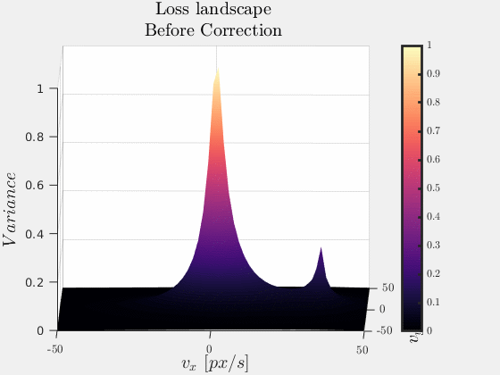
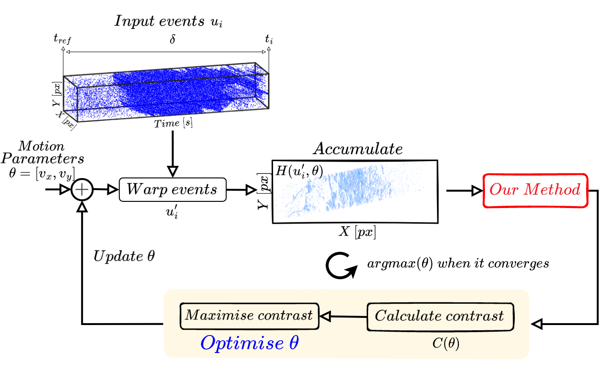
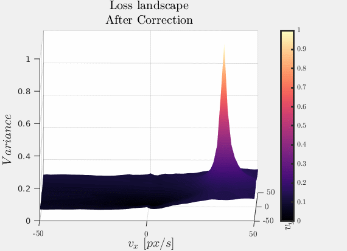
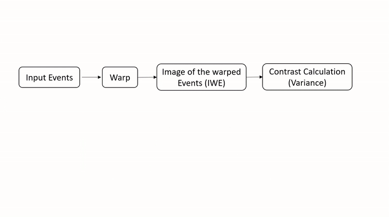
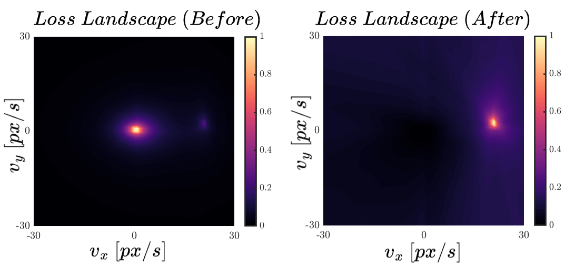

# Density Invariant Contrast Maximization for Neuromorphic Earth Observations [CVPRW2023]

Code for [Density Invariant Contrast Maximization for Neuromorphic Earth Observations](https://arxiv.org/abs/2304.14125).

```bibtex
@InProceedings{arjaDensityInvariantCMax2023,
    author    = {Arja, Sami and Marcireau, Alexandre and Balthazor, Richard L. and McHarg, Matthew G. and Afshar, Saeed and Cohen, Gregory},
    title     = {Density Invariant Contrast Maximization for Neuromorphic Earth Observations},
    booktitle = {Proceedings of the IEEE/CVF Conference on Computer Vision and Pattern Recognition (CVPR) Workshops},
    month     = {June},
    year      = {2023},
    pages     = {3983-3993}
}
```

> **Note:**  The publication of raw data is currently undergoing a review process by the Air Force Research Lab (AFRL). For further information or inquiries regarding the publication status and availability of the data, please feel free to contact us directly.

A simple noisy and dense data is provided in `data/simple_noisy_events_with_motion.es` to run the algorithm.

## Summary

This paper addresses the problem of the noise intolerance in Contrast Maximization framework and proposed an analytical solution to it. The solution was evaluated on dense event data from the ISS.

<p align="center">
  
&nbsp; &nbsp; &nbsp; &nbsp;
  
&nbsp; &nbsp; &nbsp; &nbsp;
  
</p>

## Algorithm in action

<p align="center">
  
</p>

## Install

```sh
git clone git@github.com:neuromorphicsystems/event_warping.git # alternatively, download as zip
cd event_warping
python3 -m pip install -e .
```

The installation process compiles the event_warping_extension, which is required to speed up event projection calculations. If the installation fails, you may need to install a C++ compiler with one of the following methods:

-   **Ubuntu**

    ```sh
    sudo apt install -y build-essentials
    ```

-   **macOS**

    ```sh
    xcode-select --install
    ```

-   **Windows**

    Start > Windows Powershell > Right click > Run as Administator

    ```powershell
    Set-ExecutionPolicy Bypass -Scope Process -Force; [System.Net.ServicePointManager]::SecurityProtocol = [System.Net.ServicePointManager]::SecurityProtocol -bor 2072; iex ((New-Object System.Net.WebClient).DownloadString('https://community.chocolatey.org/install.ps1'))
    choco install -y visualstudio2019buildtools
    choco install -y visualstudio2019-workload-vctools
    ```

    See https://chocolatey.org for details.

## Usage

This documentation provides instructions for utilizing the code and exploring various functionalities. Follow the steps below to get started.

#### Dataset format
The input events are assumed to be in the [event_stream (.es)](https://github.com/neuromorphicsystems/event_stream) format. Please refer to the [loris](https://github.com/neuromorphic-paris/loris) library to convert to/from .es format.

#### Generating Loss Landscape
To generate the loss landscape w.r.t the motion parameters [$v_x$,$v_y$], use `DensityInvariantCMax.py`:

First adjust the parameters as necessary.:

```
DensityInvariantCMax(filename="path_to_your_event_data",
                     heuristic=OBJECTIVE[1],
                     velocity_range=(-50, 50),
                     resolution=50,
                     ratio=0.0,
                     tstart=0,
                     tfinish=40e6,
                     read_path="data/",
                     save_path="img/")
```
and run `python DensityInvariantCMax.py`

This outputs the loss landscape across vx and vy. This is the difference between the landscapes if you used the `heuristic="variance"` (Left) and `heuristic="weighted_variance"` (Right)

<p align="center">
  
</p> 


#### Solvers

Alternatively you can choose not to compute the variance for every single $v_x$ and $v_y$ and use an optimisation algorithm to search for the best speed value by changing the `solver` and `heuristic` options in `scripts/OptimizeCMax.py`.

```
OptimizeCMax(filename="path_to_your_event_data", 
             objective=objective[1], 
             solver=solver[0], 
             tmax=10e6, 
             ratio=0.0,
             read_from="data/")
```
and run `python OptimizeCMax.py`

#### Analytical Modeling

For a detailed understanding of the analytical modeling approach, refer to the provided Jupyter notebooks:
- [analysis_1d.ipynb](scripts/analysis_1d.ipynb)
- [analysis_2d.ipynb](scripts/analysis_2d.ipynb)

These notebooks contain explanations and code snippets showcasing the analytical approach.

#### Real-World Implementation

For the actual implementation on the real-world ISS data: 
- [implementation.py](scripts/implementation.py)

#### Extending Heuristics and Solvers

To implement a new heuristic and/or a new solver, you can edit the file inside: `event_warping/*.py`, or if you want to implement them in C++ then you can edit the file inside `event_warping_extension/*.cpp`. However, if you edit the .cpp file, you have to run this command in the terminal to enable the changes:

```python3 -m pip install -e .```
